# Instruction-Tuned GPT2 (Medium) — *Built from Scratch with PyTorch*


---

## 📝 Table of Contents
- [📌 About the Project](#-about-the-project)
- [📉 Model Performance](#-model-performance)
- [🧠 Architecture Overview](#-architecture-overview)
- [🛠️ Requirements](#️-requirements)
- [🚀 How to Use](#-how-to-use)
- [🧪 Sample Inference](#-sample-inference)
- [📄 License](#-license)
- [📧 Contact](#-contact)

---

## 📌 About the Project

This project demonstrates how to **build a GPT2-Medium (355M parameters) transformer from scratch using PyTorch** and fine-tune it using an **instruction-tuning dataset** in the format:

```json
{
  "input": "Who is the author of 'Pride and Prejudice'?",
  "output": "Jane Austen."
}
```


Key Highlights:
- Manually implemented Transformer blocks, multi-head attention, and GELU activation
- Loaded pretrained weights from GPT2-Medium (OpenAI)
- Uses OpenAI's `tiktoken` tokenizer
- Implements generation with greedy and top-k sampling
- Saves model outputs to a structured JSON for evaluation

---

## 📉 Model Performance

| Epoch | Train Loss | Val Loss |
|-------|------------|----------|
| 1     | 0.553      | 0.849    |
| 2     | 0.366      | 0.702    |
| 3     | 0.246      | 0.678    |

> 📈 The model shows steady improvement and generalizes well on validation instructions.

---

## 🧠 Architecture Overview

### 🧱 Instruction-Tuned Decoder-Only Transformer

```mermaid
flowchart TD
    classDef gpt fill:#f5f9ff,stroke:#5a91d4,stroke-width:2px,color:#333;

    subgraph "GPT2 (Decoder-only Transformer)"
        direction TB
        A["Input Instruction"] --> B["Tokenizer (tiktoken)"]
        B --> C["Token IDs"]
        C --> D["Token + Positional Embeddings"]
        D --> E["12× Transformer Blocks"]
        E --> F["Final LayerNorm"]
        F --> G["Linear Output Layer (50257)"]
        G --> H["Autoregressive Generation"]
        
        class D,E,F,G gpt
    end

```


## 🛠️ Requirements
```python
pip install torch tiktoken tqdm
```

## 🚀 How to Use
### 1. Clone the Repository
```
git clone https://github.com/syed-masood-pro/Instruction-Tuned-GPT-style-Transformer-from-Scratch.git
cd Instruction-Tuned-GPT-style-Transformer-from-Scratch
```

### 2. Prepare the Instruction Data
Create a JSON file like this:

```json
{
  "input": "Who is the author of 'Pride and Prejudice'?",
  "output": "Jane Austen."
}
```
Name it `instruction-data.json.`

### 3. Run Training
```python
from train import train_model_simple

train_model_simple(
  model=gpt2_model,
  train_loader=train_loader,
  val_loader=val_loader,
  optimizer=optimizer,
  device=device,
  num_epochs=3,
  eval_freq=5,
  eval_iter=5,
  start_context=format_input(val_data[0]),
  tokenizer=tokenizer
)
```

### 4. Inference on Test Data
```
python

from inference import generate_response

input_text = format_input(test_data[0])
response = generate_response(input_text, model, tokenizer)
print("Response:", response)
```

### 5. Save All Responses
```
python
with open("instruction-data-with-response.json", "w") as f:
    json.dump(test_data, f, indent=2)
```

## 🧪 Sample Inference

```text
Instruction:
Rewrite the sentence using a simile.
The car is very fast.

✅ Correct Response:
The car is as fast as lightning.

🤖 Model Response:
The car is as fast as a bullet.
``` 
```text
Instruction:
What is the capital of the United Kingdom?

✅ Correct Response:
London.

🤖 Model Response:
London.
```


## 📄 License
This project is licensed under the MIT License.

## 📧 Contact
**Syed Masood**

✉️ syedmasood.pro@gmail.com

🔗 [GitHub](https://github.com/syed-masood-pro/)

💼 LinkedIn

